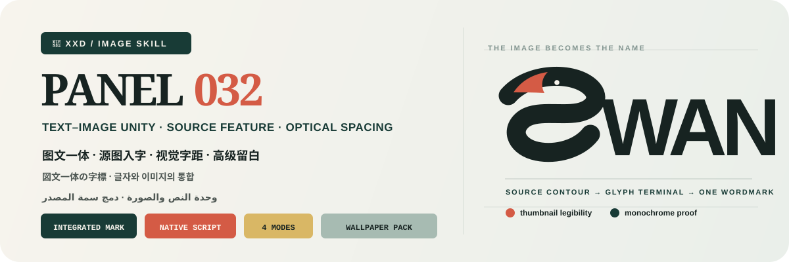
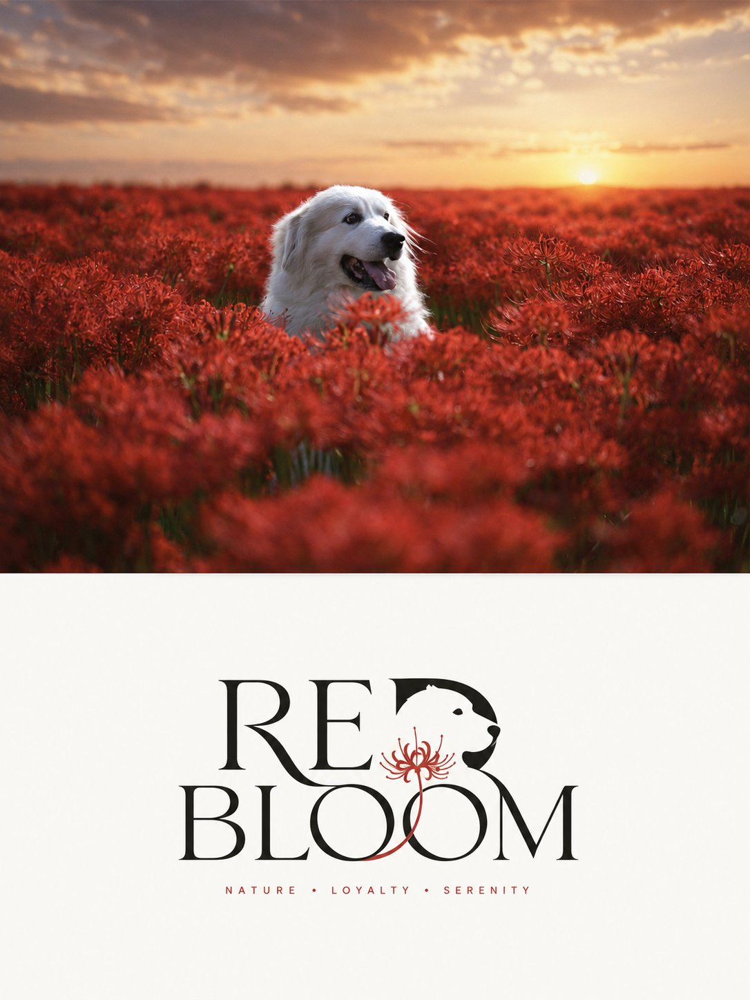
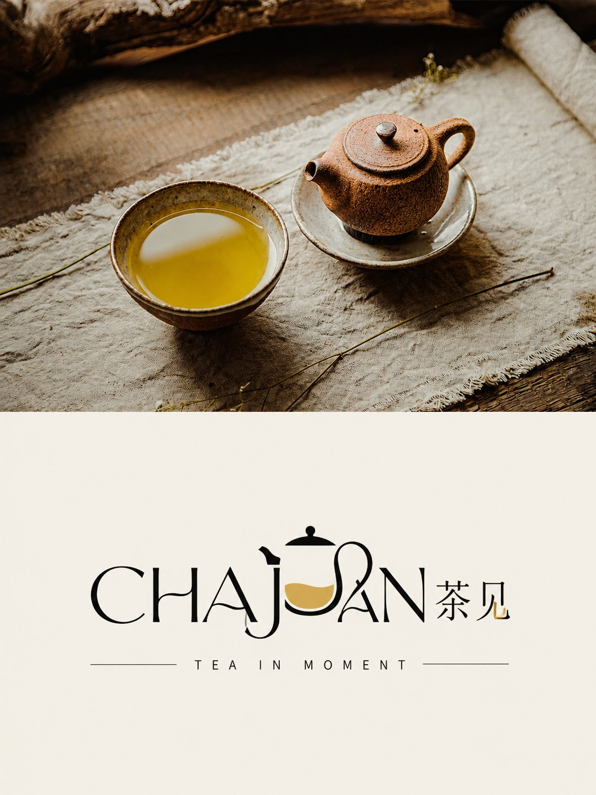
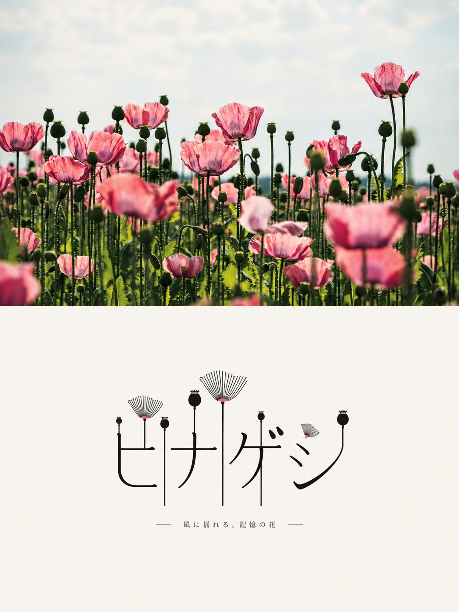
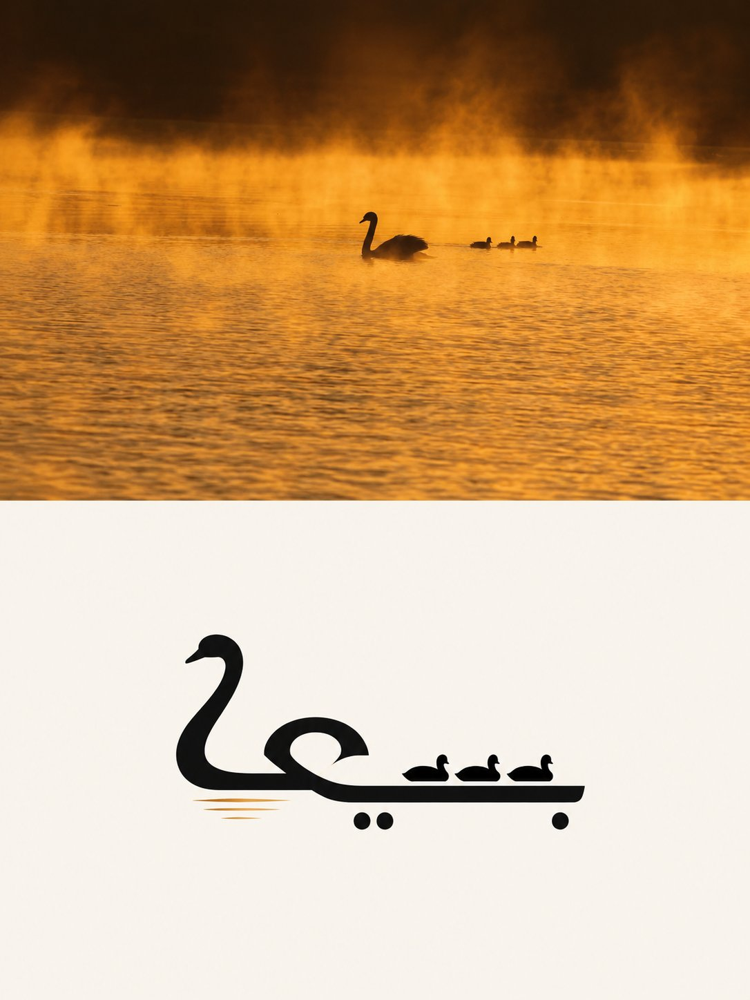

<p align="center">
  
</p>

<div align="center" dir="rtl">

# 🦁 XXD Panel 032

### يحوّل السمة الحاسمة في الصورة إلى بنية العلامة النصية المخصصة نفسها

[](./SKILL.md)
[](#أربعة-مخرجات-ونظام-واحد-لعلامة-نصية-متكاملة)
[](#الحدود-والثقة)

<a href="README.md">简体中文</a> · <a href="README.en.md">English</a> · <a href="README.ja.md">日本語</a> · <a href="README.ko.md">한국어</a> · <strong>العربية</strong>

</div>

<div dir="rtl">

> وحدة النص والصورة · حروف أصيلة للخط · دمج سمة المصدر · تباعد بصري · فراغ واسع

XXD Panel 032 مهارة لتوليد الصور مخصّصة لـ Codex والوكلاء المتوافقين. تستخرج من الصورة أكثر محيط أو نسبة أو وضعية أو فتحة أو محور أو اتصال أو وظيفة أو فراغ سالب تميّزاً، ثم تجعل هذه السمة تبني حرفاً أو محرفاً أو كتلة مقطعية كورية أو صيغة عربية سياقية متصلة أو رباطاً أو تجويفاً أو نهاية أو عارضة أو مفصل ضربة أو محيط العلامة النصية كلها.

يفضَّل للنص الرئيسي اسم علم موثَّق، وإن لم يوجد تُشتق كلمة أو عبارة قصيرة بلغة الجمهور من المصدر نفسه. يعتمد النص والصورة أحدهما على الآخر، فلا يبقى رمز منفصل بجوار خط عادي. وتنتج هوية ناضجة من منطق ضربات موحّد، وتجويفات دقيقة، وتباعد بصري مصقول، وقابلية للقراءة في المصغرات واللون الواحد، ومقياس متوسط، ولون مقتصد، وفراغ واسع.

## لماذا توجد 032؟

ينحدر «الشعار المصنوع من صورة» بسهولة إلى أيقونة بجوار عنوان، أو رسم صغير داخل خط جاهز، أو شارة سياحية، أو لغز بصري لا يُقرأ.

تعكس 032 هذا الترتيب:

```text
تثبيت الهوية والنسب والوضعية والوظيفة ← تحديد نص رئيسي قصير في نظام الكتابة المستهدف ← استخراج أقوى محيط أو فتحة أو محور أو اتصال أو فراغ سالب ← دمجه في محرف أو تجويف أو نهاية أو عارضة أو مفصل أو رباط أو محيط الكلمة الحقيقي ← إعادة رسم بقية الحروف بمنطق الضربات نفسه ← صقل التباعد والتجويفات والمركز البصري ← اختبار القراءة في المصغر واللون الواحد ← عرض علامة متوسطة بلون مقتصد وفراغ واسع
```

إذا أمكن استبدال المصدر بصورة لا صلة لها من دون تغيير جوهري في التدخل داخل المحرف أو محيط العلامة أو التجويف أو منطق الضربات أو التباعد أو اختيار الاسم، فالنتيجة ليست 032.

## العقد البصري لـ 032

- **هوية المصدر:** تحفظ ثلاث علامات محددة على الأقل النسب وتدفق المحيط والوضعية والاتجاه والفعل والوظيفة والعلاقة.
- **تسمية أصيلة ومدعومة:** يُستخدم اسم موثّق أو لفظ موجز مستند إلى المصدر بلغة الجمهور؛ ولا يُختلق مالك أو نص زائف.
- **تدخل واحد من المصدر:** يُدمج محيط أو وظيفة أو فتحة أو اتصال أو فراغ سالب حاسم في البنية الحقيقية للحرف.
- **اعتماد متبادل:** إذا أزيل التدخل أصبحت العلامة عادية، وإذا أزيلت الحروف لم تبق أيقونة مستقلة.
- **حمض نووي واحد للحروف:** تنتمي سماكة الضربات ونهاياتها ومنحنياتها وزواياها وتجويفاتها وخطها الأساس وتصحيحاتها البصرية إلى نظام مصمم واحد.
- **تباعد بصري مصقول:** يُضبط تقارب كل زوج، والتجويف الداخلي، والفراغ الخارجي، والتجاوز، والتوازن، والمركز البصري عمداً.
- **اختبار المصغر واللون الواحد:** تبقى العلامة مقروءة في الحجم الصغير ومميزة بلون واحد.
- **عرض مقتصد:** علامة واحدة متوسطة على أرضية فاتحة، بالأسود والأبيض أو بلكنة واحدة من المصدر، مع فراغ واسع ومن دون نموذج عرض أو مشهد إعلاني.

## النماذج · من X

> [Xiaoxiaodong (@xiaoxiaodong01)](https://x.com/xiaoxiaodong01/status/2090616800711229764) · 2026-08-21<br>
> GPT2 x 浮雕 x 裁剪 x 冷静 x 美学提示词 x VOL.026<br>
> ورد في عنوان المنشور الأصلي VOL.026 بالخطأ؛ وقد أكد المؤلف أن نماذج الشعار والعلامة النصية هذه تخص XXD Panel 032.

<table>
  <tr>
    <td width="50%"><a href="https://x.com/xiaoxiaodong01/status/2090616800711229764"></a></td>
    <td width="50%"><a href="https://x.com/xiaoxiaodong01/status/2090616800711229764"></a></td>
  </tr>
  <tr>
    <td width="50%"><a href="https://x.com/xiaoxiaodong01/status/2090616800711229764"></a></td>
    <td width="50%"><a href="https://x.com/xiaoxiaodong01/status/2090616800711229764"></a></td>
  </tr>
</table>

<p align="center"><a href="https://x.com/xiaoxiaodong01/status/2090616800711229764">عرض المنشور الأصلي والتوجيه كاملاً ←</a></p>

تعرض هذه النماذج الدافع الجمالي للإصدار 032 فقط؛ ولا تصبح موضوعاتها أو تكوينها أو ألوانها أو نصوصها أو نسبة اللوحة السابقة مراجع للتوليد أو إعدادات افتراضية حالية.

## أربعة مخرجات قابلة للجمع

يمكن اختيار نمط واحد أو عدة أنماط بـ `1` أو `1+3` أو `1,2,4` أو `الكل`؛ وينتج «الكل» سبعة ملفات PNG مستقلة لكل مصدر. بعد اختيار النمط وقبل التوليد، تُحسم نسبة لوحة الناتج كاملة: `3:4` الخاصة بالتوجيه الأصلي، أو نسبة المصدر باختيار صريح، أو نسبة شائعة، أو نسبة／بكسلات مخصصة. لا تُطبّق أبعاد المصدر ضمنياً.

| النمط | قاعدة اللوحة | الناتج |
| --- | --- | --- |
| `top-bottom` | لوحة نهائية أكدها المستخدم | توليد كامل واحد: المصدر عالي الوفاء في الأعلى وتصميم 032 في الأسفل، نحو 50/50 |
| `left-right` | لوحة نهائية أكدها المستخدم | توليد كامل واحد: المصدر عالي الوفاء يساراً وتصميم 032 يميناً، نحو 50/50 |
| `design-only` | لوحة نهائية أكدها المستخدم | يملأ تصميم 032 اللوحة ولا تظهر صورة المصدر |
| `wallpaper-pack` | تأكيد مستقل لكل جهاز | ملفات PNG منفصلة للهاتف وiPad والحاسوب وساعة الأطفال |

تستخدم الأنماط الثنائية المصدر كمدخل تحرير／مرجع عالي الوفاء، وتولّد التكوين النهائي مباشرة بتوجيه الأسلوب الكامل كي تتماسك الصورة والتصميم واللون والضوء والكتابة والمعنى. ولا يُستخدم التركيب الحتمي إلا بعد فشل إعادة محاولة محددة للوحة الكاملة، أو عند طلب حفظ المصدر بكسلاً ببكسل، أو عجز مسار التوليد عن تحقيق اللوحة، أو للحاجة إلى معايرة نهائية بلا فقد.

يمكن أن تكون الخلفيات مترابطة أو مستقلة. تعتمد المترابطة عملاً مرجعياً واحداً لـ iPad ثم تعيد تكوين كل جهاز من الأصل والمرجع نفسه. أما المستقلة فيرجع كل جهاز فيها إلى الأصل وحده. ولا يقص أي منهما ناتج جهاز آخر ولا يسلسل المشتقات.

## النص نفسه هو موضوع التصميم

قبل التوليد، اختر نصاً تلقائياً أو نصاً مخصصاً أو نتيجة بلا نص. عند وجود نص، حدّد اللغة أو المنطقة المستهدفة.

يفضّل النص التلقائي اسم العلم الموثّق. وإن لم يوجد، يشتق كلمة أو عبارة قصيرة يسهل تذكرها من هوية المصدر أو موضوعه أو دليل المكان أو حالة الفعل أو معنى مدعوم، ولا يختلق مؤسسة أو ملكية.

الافتراضي علامة نصية مخصصة واحدة. لا تضاف من صفر إلى عبارتين وصفيتين أصغر بكثير إلا إذا حملتا معلومة حقيقية. تُصمَّم العربية واللاتينية والصينية واليابانية والكورية وفق بنية كل نظام كتابة، ويُحفظ نص المستخدم النهائي حرفياً ولا يُولّد خط زائف. ويجب أن تنجح النتيجة في اختبار الاعتماد المتبادل واختبار استبدال الصورة غير المرتبطة.

يحافظ على النص النهائي الذي يقدمه المستخدم حرفياً. أما الاتجاه الإبداعي أو المسودة القابلة للتحرير فلا تُصقل إلا مع الحفاظ على الجمهور والهدف والكلمات الإلزامية والنبرة والدلالة.

تتبع اللغة الجمهور المقصود لا لغة الأمر:

```text
السوق أو الجمهور المستهدف > لغة الناتج المحددة > لغة التوجيه؛ وإذا غابت كلها يُسأل المستخدم قبل التوليد
```

تستخدم النسخة اليابانية يابانية طبيعية، والنسخة الكورية كورية طبيعية بمسافات صحيحة، والنسخة البريطانية إنجليزية بريطانية، وتستخدم العربية افتراضياً العربية الفصحى المعاصرة مع تركيب حقيقي من اليمين إلى اليسار. لا تستنتج المهارة الجنسية من الوجه أو الملابس أو المشهد أو اللافتات، ولا تستخدم نصاً أجنبياً زائفاً للزينة.

## أولوية اللوحة الكاملة وحدود الصورة النقطية

يتولى نموذج الصور إعادة البناء الجمالي للعمل النهائي كله، وتستخدم التركيبات الثنائية أيضاً توليد لوحة كاملة واحدة افتراضياً. ولا يبقى `scripts/compose_panel.py` إلا للاسترداد المشروط ومعايرة البكسلات بلا فقد والتدقيق للقراءة فقط؛ فلا يعمل مسبقاً ولا يحكم على النجاح الجمالي.

كل التسليمات ملفات PNG نقطية، وينشئ كل استدعاء مهمة جديدة تحت `~/Desktop/xxd/`. ولا يكشف مسار الصور المضبوط سوى حالة منزوعة التفاصيل، من دون المزوّد أو نقطة الاتصال أو بيانات الاعتماد أو الرؤوس أو التوجيهات أو الاستجابات أو معلومات الحساب. ولا تصلح SVG أو HTML أو Canvas أو الرسوم البرمجية بديلاً للعمل النهائي.

## عناصر اختيار ومعاملات مضمنة

عندما توفّر بيئة التشغيل عناصر تفاعلية حقيقية، تفضّل المهارة بطاقات الاختيار: يمكن تحديد عدة أنماط وعدة مقاسات عادية، بينما يكون نمط النص وعلاقة الخلفيات اختياراً واحداً. تشمل المقاسات: الضبط التلقائي، ونسبة المصدر، و1:1 و3:4 و4:3 و4:5 و5:4 و2:3 و3:2 و9:16 و16:9 و21:9 و5:7 و7:5، إضافة إلى نسبة أو دقة مخصصة. وإذا لم تتوفر عناصر تفاعلية، تستخدم المهارة قائمة مرقمة واضحة متعددة الأسطر بدلاً من مربعات اختيار وهمية غير قابلة للنقر.

يمكن أيضاً تمرير كل الإعدادات كمتغيرات ضمن أمر الاستدعاء:

```text
/xxd-panel-032 photo.jpg --mode top-bottom,design-only --size auto,3:4,9:16 --text auto --locale ja-JP
```

تشمل المعاملات `--mode` و`--size` القابل للتكرار أو الفصل بالفواصل، و`--text auto|custom|none`، و`--locale`، و`--copy`، و`--wallpaper linked|independent`، و`--wallpaper-size`، و`--out`. عند اكتمال المعاملات تُتخطّى جميع أسئلة الإعداد ويبدأ التوليد مباشرة؛ وعند نقصها يُسأل فقط عن القيم الناقصة. تُعاد صياغة كل نسبة أبعاد بصورة مستقلة، وتبقى حزمة خلفيات الأجهزة الأربعة فرعاً مستقلاً لا يتضاعف آلياً مع المقاسات العادية.

## أولوية نموذج الصور

يظل GPT Image 2 الخيار الأول افتراضياً، مع الحفاظ على سير العمل الحالي: مرجع المصدر عالي الوفاء، وحسم اللوحة النهائية قبل التوليد، وتوليد اللوحة الثنائية كاملة في عملية واحدة، وعدم استخدام التركيب البرمجي إلا كحل احتياطي مشروط.

يمكن أيضاً استخدام Seedance 5.0 Pro أو Nano Banana Pro (Gemini Image Pro) أو Nano Banana 2 (Gemini Image Flash) أو نموذج نقطي متوافق آخر عندما يكون متاحاً فعلاً عبر الأدوات الحالية أو المسارات المضبوطة، وقادراً على تلبية وفاء المصدر ونسبة اللوحة النهائية ونص اللغة المستهدفة والمراجع المتعددة للخلفيات المترابطة. يغيّر النموذج البديل مسار التوليد فقط، ولا يغيّر الأنماط أو اللوحة أو النص أو اللغة أو علاقة الخلفيات أو أولوية اللوحة الكاملة.

إذا لم يوجد مسار مناسب، تطلب المهارة من المستخدم تفعيل أداة لتوليد الصور أو تقديم API Key. يمكن استخدام بيانات الاعتماد التي يقدمها المستخدم للمهمة الحالية من دون تكرارها أو عرضها أو تسجيلها أو كشفها. ولا تُحفظ طويلاً ولا تتغير إعدادات المزوّد أو الحساب أو الفوترة أو المسار العام إلا بطلب صريح من المستخدم.

## البدء

```bash
git clone https://github.com/nevertoday/xxd-panel-032.git
mkdir -p ~/.codex/skills
ln -s "$(pwd)/xxd-panel-032" ~/.codex/skills/xxd-panel-032
```

يمكن لمستخدمي Claude Code ربط المجلد نفسه بـ `~/.claude/skills/xxd-panel-032`. أعد تشغيل جلسة الوكيل بعد التثبيت.

```text
$xxd-panel-032
حوّل هذه الصورة إلى تكوين يسار/يمين، واستخرج العبارة من معناها، واكتبها بالعربية الفصحى المعاصرة.
```

يمكن أيضاً استدعاء المهارة بصورة وحدها. ستسأل أولاً عن نمط واحد أو عدة أنماط وعن إعداد النص في قائمة مرقمة متعددة الأسطر؛ ويسأل نمط الخلفيات أيضاً عن الترابط والمقاسات.

المواصفات الكاملة:

- [مسار عمل المهارة](SKILL.md)
- [التوجيه الصيني الكامل](references/xxd-panel-032-prompt.zh-CN.md)
- [التوجيه الإنجليزي الكامل](references/xxd-panel-032-prompt.en.md)
- [موجز الأسلوب الأصلي](references/032-source.md)

## الحدود والثقة

- تبقى كل صورة داخل مهمتها ولا تستعير موضوعاً أو لوناً أو نصاً أو تكويناً من مدخل آخر أو نتيجة قديمة أو نموذج.
- ينشئ كل استدعاء مجلد مهمة جديداً، حتى عند تكرار المصدر والمعلمات.
- النتائج ملفات PNG نقطية، وليست SVG أو HTML أو Canvas أو بديلاً مرسوماً برمجياً.
- لا يعرض جسر الصور المضبوط سوى حالة منزوعة التفاصيل، ولا يكشف المزوّد أو نقطة الاتصال أو الرؤوس أو بيانات الاعتماد أو التوجيه أو نص الاستجابة.
- يعيد كل نمط عادي مختار ملفاً واحداً، ويضيف اختيار `wallpaper-pack` أربع خلفيات مستقلة. يعيد خيار «الكل» سبعة ملفات PNG لكل مصدر داخل أربعة مجلدات أنماط متجاورة، ولا ينشئ لوحة تجميع أو عرضاً عاماً.

يحتاج التركيب المحلي إلى Python 3 وPillow. يستخدم الجسر الآمن `tomllib` في Python 3.11 أو أحدث. ويحتاج توليد الصور إلى قدرة نقطية مدمجة في الوكيل المضيف أو مسار نقطي متوافق ومضبوط مسبقاً.

## المستودع

```text
xxd-panel-032/
├── SKILL.md
├── README.md / README.en.md / README.ja.md / README.ko.md / README.ar.md
├── agents/openai.yaml
├── assets/banner.svg + examples/ (محجوز لنماذج محلية مستقبلية)
├── scripts/compose_panel.py + configured_imagegen.py
└── references/xxd-panel-032-prompt.zh-CN.md + xxd-panel-032-prompt.en.md + 032-source.md
```

## عن XXD

XXD هو الاختصار التجاري لاسم Xiaoxiaodong. أنشأ المشروع ويديره [@xiaoxiaodong01](https://x.com/xiaoxiaodong01).

## الدعم والعضوية

### استشارة متعمقة · 299 يواناً صينياً/ساعة

تبلغ تكلفة الاستشارة الفردية المتعمقة في استخدام Skills مقدار 299 يواناً صينياً في الساعة. للحجز، تواصل عبر رمز WeChat أدناه.

### مجموعة مستخدمي Xiaoxiaodong Skills · 99 يواناً صينياً

تتيح دفعة واحدة قدرها 99 يواناً الانضمام إلى مجموعة تبادل سير العمل ومناقشة الأعمال والدعم بين المستخدمين. ولا تشمل الاستشارة الفردية المحسوبة بالساعة.

### Knowledge Planet＋مكتبة توجيهات الأعضاء · 699 يواناً صينياً/سنة

[Knowledge Planet](https://wx.zsxq.com/group/15554814142882) و[مكتبة توجيهات XXD](https://vip.xiaoxiaodong.ai/) عضوية واحدة: **دفعة سنوية واحدة تفتح الخدمتين من دون شراء ثانٍ.**

1. اشترك عبر Knowledge Planet ثم تواصل عبر WeChat للحصول على رمز استبدال المكتبة.
2. اشترك عبر مكتبة التوجيهات ثم تواصل عبر WeChat للحصول على دعوة إلى Knowledge Planet.

<p align="center">
  <a href="https://xiaoxiaodong.pages.dev/assets/wechat-qr.png"></a>
</p>

<div align="center" dir="rtl">

**لا تقف الصورة بجوار الاسم؛ بل تصبح هي الاسم.**

</div>

</div>

---

<div align="center" dir="rtl">
  <h2>☕ ادعم هذا المشروع مفتوح المصدر</h2>
  <p>إذا وفّر عليك المشروع وقتاً، فإن نجمة أو مشاركة أو فنجان قهوة يساعد في استمراره.</p>
  <table><tr><td align="center" width="240">
    <a href="https://github.com/nevertoday/zhongguo-traditional-colors/blob/main/docs/images/buy-me-a-coffee-qr.png?raw=true"></a><br>
    <strong>Buy me a coffee</strong><br><sub>امسح رمز QR أو افتحه لدعم Xiaoxiaodong</sub>
  </td></tr></table>
  <p><sub>الدعم اختياري تماماً ولا يغيّر حق الوصول إلى هذا المشروع مفتوح المصدر.</sub></p>
</div>
